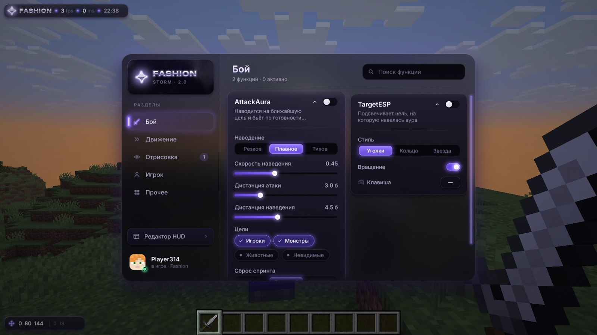

# Fashion

Клиентский мод для Minecraft 1.21.11 (Fabric, Java 21, пакет `dev.fashion`).

Интерфейс рисуется собственным слоем поверх кадра игры. Формы, стекло, тени, свечение, шрифт, раскладка и анимация написаны с нуля. Ванильные виджеты, текстуры интерфейса и ванильный шрифт не используются.



Покадровая запись всех анимаций: `docs/media/showreel.mp4` (снята с шагом 1/60 с).

## Сборка и запуск

```
./gradlew build          # jar в build/libs
./gradlew runClient      # клиент для разработки
```

## Управление

| Клавиша | Действие |
|---|---|
| Правый Shift | открыть меню |
| Esc | закрыть меню, редактор HUD или поиск |
| Ctrl+F или любая буква | поиск по функциям |
| ЛКМ по шапке карточки | свернуть или развернуть настройки |
| ЛКМ по переключателю | включить или выключить функцию |
| «Клавиша» в карточке | ЛКМ назначает клавишу, ПКМ сбрасывает |
| «Редактор HUD» в меню | перетаскивание элементов HUD с прилипанием |

Настройки, клавиши, раскрытые карточки и положения HUD сохраняются в `config/fashion.json`.

## Устройство

### Рендер (`gfx`)

- `GameRendererMixin` встраивается в кадр игры в двух местах. Перед сборкой GUI обновляется размытие мира. После отрисовки ванильного GUI `Canvas` выводит свой слой одним вершинным буфером.
- `Canvas` — пакетный отрисовщик. Каждая фигура — один квад, все её параметры едут в вершине: скругления по углам, градиент, обводка, свечение, тень, блик, хром, прямоугольник обрезки. Режимы: форма, стекло, текст, картинка, грозовые облака. Весь интерфейс уходит в несколько draw call'ов, новый вызов появляется только при смене картинки (например, скина).
- `ui.fsh` считает знаковое расстояние до скруглённого прямоугольника. Сглаживание идёт через `fwidth`, поэтому края чистые на любом масштабе и при любой деформации. Свечение и тень выводятся из того же расстояния. Тень — гауссово размытие формы через `erf`, её смещение и мягкость меняются от подъёма элемента.
- Градиенты интерполируются в OKLab и дизерятся треугольным шумом, так что на тёмных переходах нет полос.
- `Blur` — пирамида dual Kawase: 4–6 уменьшений и столько же увеличений, по 5 и 8 выборок на пиксель. Радиус широкий, работа дешёвая. Пересчёт пропускается, если кадр мира не изменился: сигнатура складывается из камеры, времени мира и паузы.
- `Font` — свой SDF-атлас. Его строит `tools/fontgen.py` по контурам шрифтов Inter (4 начертания) и Unbounded (логотип); в тот же атлас лежат векторные иконки. Кириллица, кернинг из GPOS, мип-уровни. Кегль может быть любым, в том числе дробным. Обводка и свечение текста считаются из того же поля расстояний в том же проходе, строка уходит одним пакетом.

### Движение (`anim`)

- `Spring` — пружина с аналитическим решением (недодемпфированный, критический и передемпфированный режимы). Поведение одинаково при любом FPS. Смена цели не сбрасывает набранную скорость, отсюда инерция и лёгкий перелёт.
- `Motion` — пресеты: раскладка, наведение, нажатие, переключатели, прибытие окна, уход.
- `Scroll` — прокрутка с инерцией, трением и упругими границами.
- Связность движения: карточки в колонке следуют друг за другом цепочкой пружин, при прокрутке нижние отстают сильнее верхних. Быстро движущиеся элементы слегка вытягиваются по направлению движения. Индикаторы раздела и режима тянутся ведущим краем.

### Функции (`modules`)

- **Combat:** AttackAura (наведение резкое, плавное или тихое; дистанции атаки и наведения; цели; сброс спринта: нет, легитный, быстрый) и TargetESP (уголки, кольцо или звезда вокруг цели).
- **Movement:** AutoSprint.
- **Render:** HUD (вотермарка, список функций, координаты, карточка цели).
- **Player:** ClickPearl (бросок жемчуга колесом или боковыми кнопками мыши).
- **Misc:** Placeholder.

Настройки описываются в модуле данными: `bool`, `number`, `mode`, `multi`. Интерфейс сам подбирает элемент для каждой настройки (`Row.of`), так что новая функция не требует правок в коде интерфейса. Зависимые настройки задаются через `visibleWhen`.

## Инструменты

- `tools/fontgen.py` — генератор SDF-атласа шрифтов и иконок.
- `tools/check_shaders.py` — проверка компиляции шейдеров через Mesa.
- `tools/autotest.sh` — прогон клиента в Xvfb по сценарию `dev.fashion.dev.AutoTest`: скриншоты и покадровые записи анимаций в `run/autotest`.
- `tools/jerk.py` — поиск рывков в покадровых записях.
- `tools/make_media.py` — сборка записей в mp4 и gif.

Шрифты Inter и Unbounded распространяются по лицензии SIL OFL 1.1 (`tools/fonts`).
